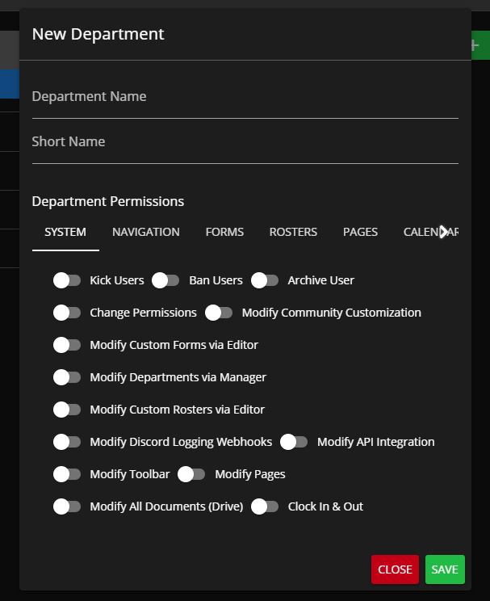
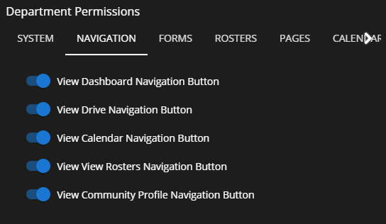
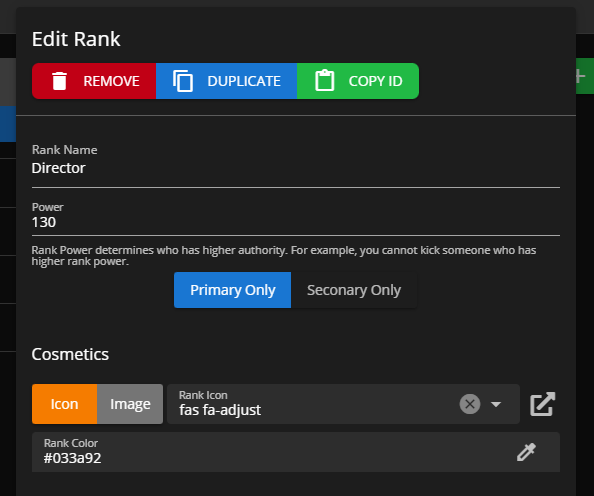
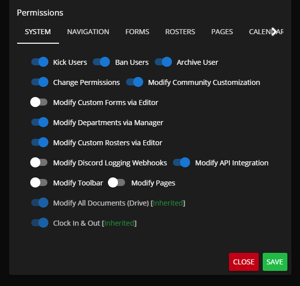

# Creating Ranks & Departments

## Accessing the Rank Manager

#### Administrative Panel > Customization > Rank Manager

Within this Rank Manager panel you'll be able to create departments and ranks  your members, this will be the central panel for deciding permissions based on "ranks", when new, removed, or modified Custom Forms, Calendar Categories, and Rosters will be reflected with available permissions under each rank.


Rank **Power** will be compared to other users as a global user power, this will be utilized to determine if you can modify other individuals. If your power is higher than another individual then you can modify them, if it's less then you cannot.


## Creating a Department

Click the "Add Department" button, which can be found at the end of your existing departments (or the beginning if you're on mobile). Once clicked, a dialog popup should appear

The dialog contains two crucial fields for your department:

1. Department Name (Example: Police Department)
2. Short Name (Example: PD)

<figure><figcaption></figcaption></figure>

All you need is the department names to make the department, so saving now is fine. However, if you want to learn about inherited permissions, check out below!

### Department Permissions

<figure><figcaption>
Sonoran CMS - Rank Editor - Default Department Permissions
</figcaption></figure>

This is where you'll need to assign permissions that you want all ranks within the department to inherit. These are the same set of permissions that ranks are able to get assigned but will be applied to all ranks upon permission evaluation.

## Creating a Rank

Under the department header in, click the green plus button to begin creating a new rank

This will show a new dialog where you'll need to specify both of the following fields:

1. Rank Name (Example: Chief of Police)
2. Power (Example: 75) _Look above at the blue informational hint for **Power** explanation._
3. Primary & Secondary Buttons
   * Activating either one will make it so the rank can only be used as a primary rank or a secondary rank. No selection means it can be used for both.

Those are all the fields you need to create the rank, but check below for options on customizing its look or adding permissions!

### Customize Rank Cosmetic Styling

<figure><figcaption>
Sonoran CMS - Department Editor - Rank Cosmetic Customization
</figcaption></figure>

Ranks are able to be customized to the styling that best fits your community, customize the color and icon associated with each rank. You can specify common color names or custom hex colors.

### Assigning Rank Permissions

<figure><figcaption></figcaption></figure>

Permissions on a rank dictate what a person with that rank can do. There are many different types of permission scopes:

* **"Form Permissions"** is for the custom forms
* **"Calendar Permissions"** are based on the calendar categories made in Administrative Panel > Customization > Customization
* **"Roster Permissions"** are based on the custom records made in Administrative Panel > Customization > Custom Roster Editor.
* **"Server Permissions"** are based on the API Integration servers made in Administrative Panel > Advanced > API Integration.
* **"Profile Fields Permissions"** are based on the Profile Fields created in the Administrative Panel > Customization > Profile Fields Editor.
