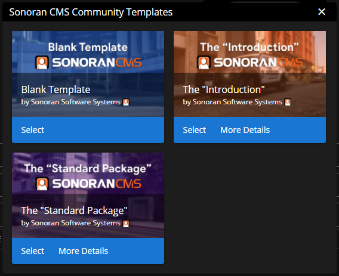

# Community Template System

### What is the Community Template System?

When creating a community or even customizing a community, you might not want to start from scratch; with the Community Template System, you'll be able to import an entire community template into your community.

If you've already created a community and want to import a template, you'll be able to specifically choose what you want to import from a template. For example, if you only like specific forms from a template, you can import only those instead of the entire template. In the future, communities will be able to submit their community to be used as a template within the system.\
\
Currently, only community owners will be able to access the "Import Community Template" button located in `Administrative Panel` > `Customization`.

### Viewing Templates

When viewing community templates it'll show you all of the accessible templates that are available given your community plan. In the future, communities will be able to import any template but will be restricted to the limits that their plan allows.

### Previewing a Template

Before selecting a template to import into your community you're given the choice to view more details and preview the template. You can do this by selecting the "More Details" button shown above on the [Viewing Templates](community-template-system.md#viewing-templates) section. When previewing a template you'll be able to see the overall stats of the template from how many departments to what plan is recommended to have with this template.

### Selecting a Template

When selecting a template, you'll be given options to choose what you want to import into your community. On top of that, you're given the option to choose if you would like to import the template into your community on top of your existing departments, rosters, etc. Or, you can choose to completely replace all of your departments, rosters, etc.


Do note that if you choose to replace all of your existing departments, rosters, etc. that it is irreversible; if you do choose to replace your existing departments, rosters, etc. that it will reset all user's permissions.


## Template Management


Template Management is only accessible through Administrative Panel > Customization > Customization. This is limited to Community Owner visibility at this time.


After creating your community and customizing it to meet your exact community needs you might want to share some elements from your CMS with other communities and this is where Template Management comes in. With Template Management you'll be able to create and update Community Template's easily based on your current community forms, departments, etc.

<figure><figcaption>
Sonoran CMS - Community Customization - Template Management
</figcaption></figure>

### Accessing Template Management

To access the Template Management dialog you will need to go to Administrative Panel > Customization > Customization > Template Management as shown below.

<figure><figcaption>
Sonoran CMS - Community Customization - Community Templates <em>Template Management Button</em>
</figcaption></figure>

### Creating a Template


Once a template is submitted you'll be able to add, update and remove elements from the template that are from your community.


Locate the "Create Template" button on the bottom of the Template Management Dialog.

You will now need to input basic information regarding your template, note that at least one preview image is required.

<figure><figcaption>
Sonoran CMS - Template Creation - Basic Information Dialog
</figcaption></figure>

Once you complete this dialog you can press Next.

You will now need to select which elements of your community you'd like to include in the template as shown below.

<figure><figcaption>
Sonoran CMS - Template Creation - Data Selection
</figcaption></figure>

Once you select which elements from your community you'd like you can press Next.

Now that you've selected what you want included and added basic information regarding your template you can now finalize it.

You will be now shown a full list of everything included in the template, from here you can easily remove elements from the list however you want to add elements you will need to go back and add them.

<figure><figcaption>
Sonoran CMS - Template Creation - Finalize
</figcaption></figure>

Once you ensure that everything is what you want you can go to the bottom and hit submit, this will submit your template to the Sonoran CMS Development Team to review and process. You Community Template should be reviewed within 3-5 business days however if you don't seem to get a notification regarding any status change you can [open up a ticket](https://support.sonoransoftware.com/) to inquire about it.

<figure><figcaption>
Sonoran CMS - Template Creation - Submission Alert
</figcaption></figure>

### Managing Created Templates

Now that you've created a template you will want to know how to view and update the template when it's needed. Once you create the template you will need to go back to the original Template Management dialog, once there you will notice your template is now there with the name and status. There's also two buttons, "View" and "Manage", "View" will obviously allow you to view the various elements and information regarding the template. "Manage" will allow you to add, remove and update elements and information on your template.

<figure><figcaption>
Sonoran CMS - Template Management - Viewing Created Template
</figcaption></figure>

<figure><figcaption>
Sonoran CMS - Template Management - Managing Created Template
</figcaption></figure>

When managing a created community template you may run into two things:

* "Update" button to the left of the checkbox
  * This means that the template for that specific element is out of date compared to what your community is using, this will update the template to what your community has for this element. Just click the "Update" button if wanting to update that element.
* "Not Associated" red tag to the right of the element name
  * This means that the template element is no longer associated with the community, meaning once it's uncheck it will be gone from the template forever.

<figure><figcaption>
Sonoran CMS - Template Management - Managing Created Template
</figcaption></figure>

Once you're satisfied with the changes you made to the template you can click Save at the bottom.

Once you save the template it will need to go through another review process with the Sonoran CMS Development Team, this is expected to take 3-5 business days however if you do not get a notification regarding any status change feel free to [open up a ticket](https://support.sonoransoftware.com/) to inquire about it.
