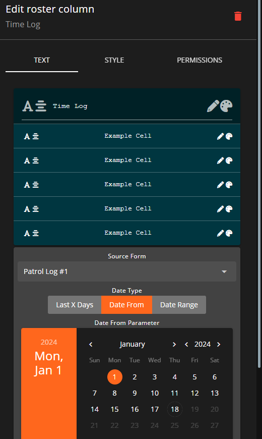
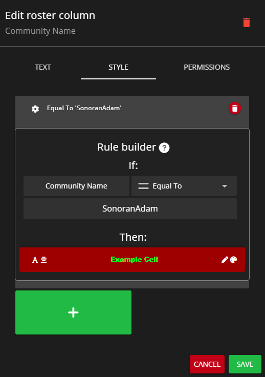
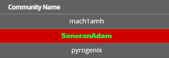
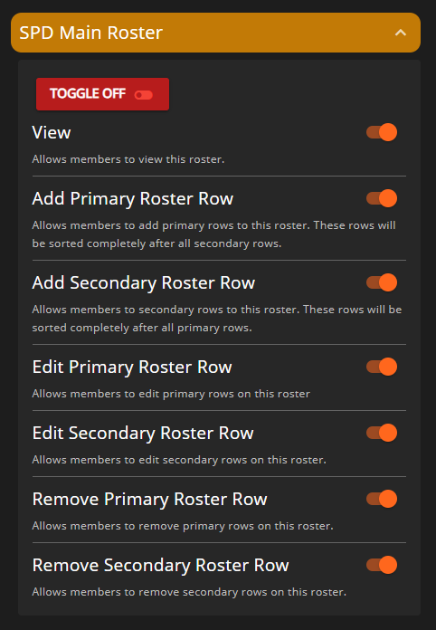
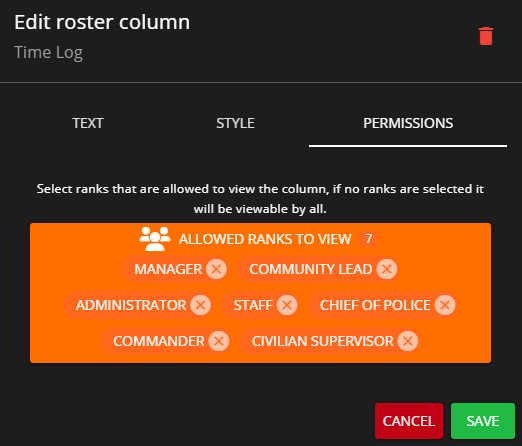
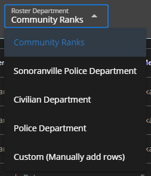

# Creating Rosters



## Accessing the Roster Editor

To access the "Roster Editor", navigate to `Administrative Panel` > `Rosters`

Within this "Roster Editor" panel you'll be able to create custom and automatic rosters with whatever columns you please. You can specify some of the columns to utilize the custom column types that are in place such as the:

* **Patrol Log Hours** column type requires a custom form to be created that is a Form Type of `Patrol Log`.
  * This column type will automatically calculate hours based on form submissions from a specific time till the current time.
* **Status Selector** column type allows the roster to display custom statuses set in the "Roster Statuses" section of the Roster Editor.
* **Activity Tracker Hours** column type displays how many hours a user has played on the selected server in a specified time period.&#x20;
  * This requires that you've added a server in `Settings` > `SonoranCMS API` > `Servers` and have also set up an [in-game integration resource](https://info.sonorancms.com/integration-capabilities/in-game-integration-resources/gta-rp-integrations/available-resources/core) on that server.
* **Last Active** column type displays the date and time which a user was last active on the selected server.
  * Just like with **Activity Tracker Hours**, this also requires that you've added a server in `Settings` > `SonoranCMS API` > `Servers` and have also set up an [in-game integration resource](https://info.sonorancms.com/integration-capabilities/in-game-integration-resources/gta-rp-integrations/available-resources/core) on that server.


If using a field of type **Patrol Log**, **Activity Tracker Hours**, or **Last Active**, ensure that you select a form or server from the "Source Form" / "Source Server" dropdown.&#x20;

For the former two, also ensure you specify the date range or time period that the data should be sourced from.


<figure><figcaption>
Sonoran CMS - Create Custom Roster
</figcaption></figure>

Along the top bar of the editor itself, you can also select an icon which will show at the top of the roster.

## Roster Customization & Permissions

You also have customization options for the display of any column you have added to the roster. To edit these, click on any column to open the editor popup.

If you have a column of type **Time Log Hours**, you can select what form the time logs are being pulled from. Similarly, you can also set the date type to choose whether it pulls time log hours from the last X days, after X date, or within the selected date range.

For each column in the roster editor, you can customize the styling including text color, background color, font, and alignment, as well as the name of the column itself. You can style the content cells differently from the header cell if you wish.

<figure><figcaption>
Sonoran CMS - Roster Editor - Edit Roster Column
</figcaption></figure>

### Style Rule Builder

In the `Style` tab, you can use the rule builder to set conditionals that change the style of cells that meet the given criteria. For example, if you have a column for `Community Name`, you can create a style rule where if a user's `Community Name` is `equal to` a certain value, in this example, `SonoranAdam`, then the styling will be what has been set below `Then:`.

<figure><figcaption>
Sonoran CMS - Roster Editor - Rule Builder
</figcaption></figure>

As you can see, the user `SonoranAdam` now has a red background with green text in Impact font, as specified in the Rule Builder above:

<figure><figcaption>
Sonoran CMS - Example Roster
</figcaption></figure>

You can also use rules for if a value is `greater than`, `less than`, or `not equal to` a set value.

### Roster Permissions

You can also customize the roster's permissions, which determine who is allowed to view and edit it. These permissions apply to the roster as a whole. If you would like to restrict viewing a certain column to only specified ranks, please see [Column Permissions](creating-custom-rosters.md#column-permissions)

These permissions are housed within [Department & Rank Permissions](creating-departments.md) and can be customized for any rank on any individual roster as shown belo**w:**

<figure><figcaption>
Sonoran CMS - Rank Editor - Roster Permissions
</figcaption></figure>


Whenever you create new rosters you will need to explicitly give ranks permissions to the new roster to be used by other individuals. This can be done in the [Department Manager](creating-departments.md).

If a user has permission to a specific roster they'll be able to access it on the left side menu under the "Rosters" dropdown.


### Column Permissions

In the roster column editor, you can select any rank that you wish to be able to view a column. If you do not select any ranks, then the column will be viewable by all.

<figure><figcaption>
Sonoran CMS - Roster Editor - Column Permissions
</figcaption></figure>

## Roster Type Explained

#### Custom - Manually Add Rows

This is the original roster type, this allows you to add and remove roster rows as you please that are associated to members. This allows you to determine the exact order in which rows are sorted.

#### Department - Automatic

This is an automatic roster type, this will automatically grab all community members that hold a rank within the specified department and will automatically generate a roster row for each one in the order which the ranks are listed within the department. This still allows you to edit data that's tied to a specific row. For example, if Johnny B. has a row and you want to add a note to the Note column then you can add it and it will be automatically fetched and added to the generated row.


You **CANNOT** change the order which rows appear, they're sorted in which the ranks appear in the department and alphabetically by the member's name.


### Creating a Department Roster

Creating a Department type roster is as easy as creating a custom roster without the headache of adding each individual row for each member. In the Roster Editor, along the top bar click the **Roster Departments** dropdown menu and select what department you would like this roster to be associated with.

<figure><figcaption>
Sonoran CMS - Roster Department Selector
</figcaption></figure>

Once you've figured out the department for this roster you can now design the roster columns as you please.\
\
Don't forget to click the green **Save** button once you've finished. Once it's saved you can go to the automatic roster and see all the generated rows.


Rows **CANNOT** be removed from a department roster, these rows are dynamically generated with any previous data saved associated with it.

