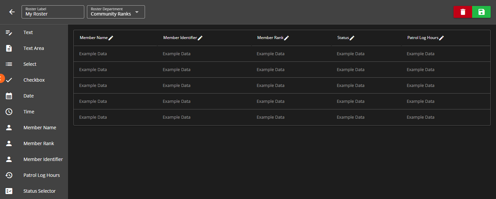
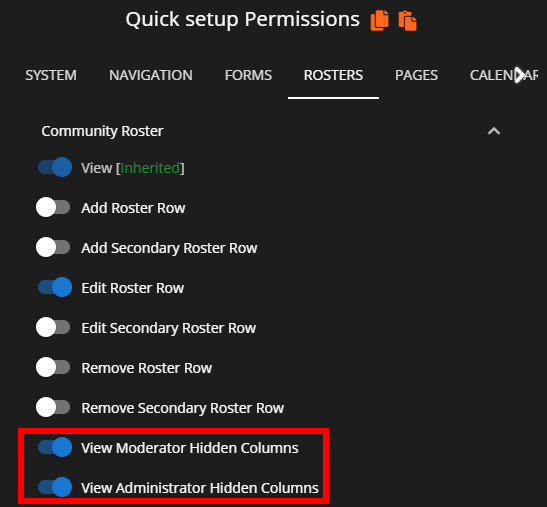

# Creating Rosters



## Accessing the Roster Editor

To access the "Roster Editor", navigate to `Administrative Panel` > `Rosters`

Within this "Roster Editor" panel you'll be able to create custom and automatic rosters with whatever columns you please. You can specify some of the columns to utilize the custom column types that are in place such as the:

* **Patrol Log Hours** column type requires a custom form to be created that is a Form Type of `Patrol Log`.
  * This column type will automatically calculate hours based on form submissions from a specific time till the current time.
* **Status Selector** column type allows the roster to display custom statuses set in the "Roster Statuses" section of the Roster Editor.


Ensure that you select the Patrol Log form from the "Source Form" dropdown and ensure to input the date/time in the "Start Date" input.


<figure><figcaption>
Sonoran CMS - Create Custom Roster
</figcaption></figure>

### Roster Customization & Permissions

You also have customization options for the display of any column you have added to the roster. To edit these, click the pencil icon to the right of any column to open the editor popup.

Here you can change the name of the column and the type of column it is. If you have a column of type **Patrol Log Hours**, you can select what form the time logs are being pulled from. Similarly, you can also set the start date so that it only shows patrol log hours logged _after_ this date.

You can also customize the alignment of the content and the permissions, which determine who is allowed to view it. The permissions options are as follows:

* **Everyone:** Everyone who can view this roster can view this column
* **Mod & Admins:** Viewing this column is restricted to moderators and administrators only
* **Admins:** Viewing this column is restricted to administrators only

These permissions are housed within [Department & Rank Permissions](creating-departments.md) and can be customized for any rank on any individual roster as shown below:

<figure><figcaption>
Sonoran CMS - Rank Editor - Roster Permissions
</figcaption></figure>


Whenever you create new rosters you will need to explicitly give ranks permissions to the new roster to be used by other individuals. This can be done in the [Department Manager](creating-departments.md).

If a user has permission to a specific roster they'll be able to access it on the left side menu under the "Rosters" dropdown.


### Roster Type Explained

#### Custom - Manually Add Rows

This is the original roster type, this allows you to add and remove roster rows as you please that are associated to members. This allows you to determine the exact order in which rows are sorted.

#### Department - Automatic

This is an automatic roster type, this will automatically grab all community members that hold a rank within the specified department and will automatically generate a roster row for each one in the order which the ranks are listed within the department. This still allows you to edit data that's tied to a specific row. For example, if Johnny B. has a row and you want to add a note to the Note column then you can add it and it will be automatically fetched and added to the generated row.


You **CANNOT** change the order which rows appear, they're sorted in which the ranks appear in the department and alphabetically by the member's name.


### Creating a Department Roster

Creating a Department type roster is as easy as creating a custom roster without the headache of adding each individual row for each member. In the Roster Editor, along the top bar click the **Roster Departments** dropdown menu and select what department you would like this roster to be associated with.

<figure><figcaption>
Sonoran CMS - Roster Department Selector
</figcaption></figure>

Once you've figured out the department for this roster you can now design the roster columns as you please.\
\
Don't forget to click the green **Save** button once you've finished. Once it's saved you can go to the automatic roster and see all the generated rows.


Rows **CANNOT** be removed from a department roster, these rows are dynamically generated with any previous data saved associated with it. Once a row is&#x20;

