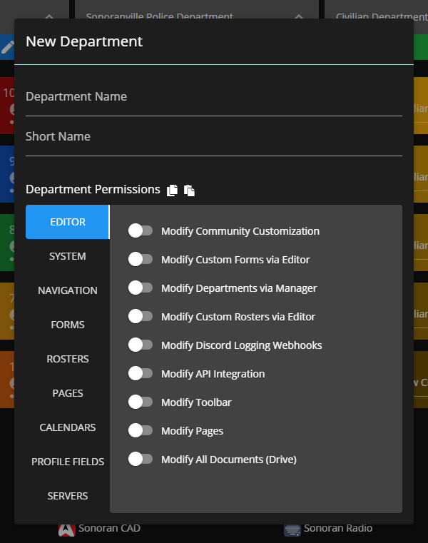
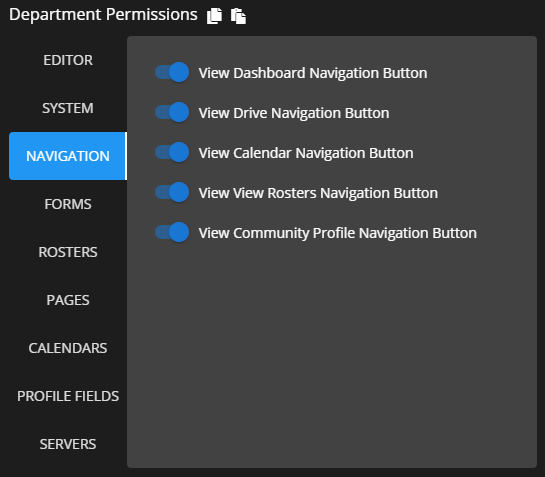
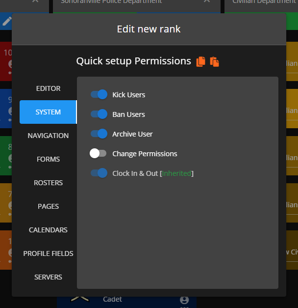
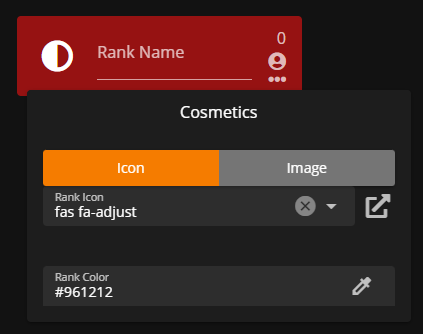
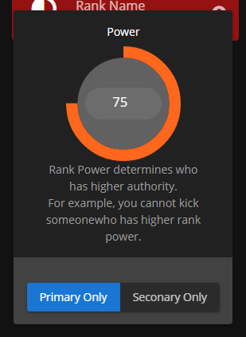

# Creating Ranks



## Accessing the Rank Manager

To access the "Rank Manager", head to `Administrative Panel` > `Ranks`

Within this Ranks panel you'll be able to create departments and ranks  your members, this will be the central panel for deciding permissions based on "ranks", when new, removed, or modified Custom Forms, Calendar Categories, and Rosters will be reflected with available permissions under each rank.


Rank **Power** will be compared to other users as a global user power, this will be utilized to determine if you can modify other individuals. If your power is higher than another individual then you can modify them, if it's less then you cannot.


## Creating a Department

Click the "Add Department" button, which can be found at the end of your existing departments (or the beginning if you're on mobile). Once clicked, a dialog popup should appear

The dialog contains two crucial fields for your department:

1. Department Name (Example: Police Department)
2. Short Name (Example: PD)

<figure><figcaption>
Sonoran CMS - Department Editor - Creating a Department
</figcaption></figure>

You do not need to customize anything to create your department, so saving now is fine. When you're ready to save, click anywhere outside the department box. Or, you can set permissions associated with the department.

### Department Permissions

<figure><figcaption>
Sonoran CMS - Rank Editor - Setting Department Permissions
</figcaption></figure>

This is where you'll need to assign permissions that you want all ranks within the department to inherit. These are the same set of permissions that ranks are able to get assigned but will be applied to all ranks upon permission evaluation.

## Creating a Rank

Under the department header in, click the green plus button to begin creating a new rank

This will bring up a new dialog where you'll need to setup permissions for your new rank.

Permissions on a rank dictate what a person with that rank can do. There are many different types of permission scopes:

### Assigning Rank Permissions

Rank permissions can be assigned using the same method as department permissions. There are many different categories of permissions you can assign, for example:

* **"Editor"** permissions are for modifying the community and customizations.
* **"System"** permissions are for general administration (e.g. kick, ban, clock in & out).
* **"Navigation"** permissions are for viewing navigation buttons.
* **"Forms"** permissions are for the custom forms.
* **"Rosters"** permissions are based on the custom records made in `Administrative Panel` > `Rosters`.
* **"Calendars"** permissions are based on the calendar categories.
* **"Profile Fields"** permissions are based on the Profile Fields created in the `Administrative Panel` > `Profile Fields`.
* **"Servers"** permissions are based on the API Integration servers made in `Administrative Panel` > `Integrations`.

<figure><figcaption>
Sonoran CMS - Department Editor - Rank Permissions
</figcaption></figure>

When you are done customizing your rank permissions, click anywhere outside to close the dialog and automatically save it. Your new rank will show up under the department you created it in. You can click "Rank Name" to input a name for your rank.&#x20;

If you ever want to modify permissions, click the person icon to the right of the name to open the dialog again.

### Customize Rank Cosmetic Styling

Ranks are able to be customized to the styling that best fits your community. You are able to customize the color and icon associated with each rank. You can specify common color names or custom hex colors. To access this setting, click on the icon to the left of the rank name.

<figure><figcaption>
Sonoran CMS - Department Editor - Rank Cosmetic Customization
</figcaption></figure>

### Customize Rank Power

To the top right of the rank name you will see a number, by default it is 0. Click on this to access the rank power tab. Rank Power determines who has higher authority in the community.

Below this you will be able to specify whether this is a primary or secondary rank. Activating either one will make it so the rank can only be used as a primary rank or a secondary rank. No selection means it can be used for both.

<figure><figcaption>
Sonoran CMS - Department Editor - Rank Power
</figcaption></figure>
