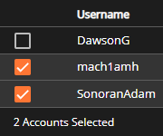
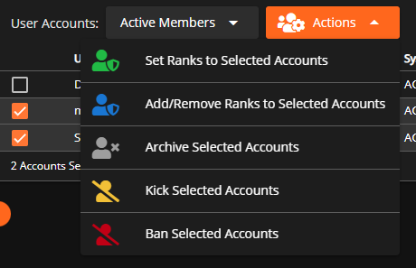
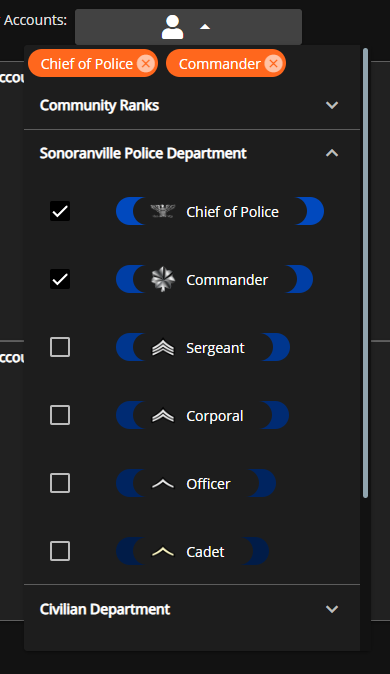

# Setting User Ranks




Make sure that you've viewed the [**Creating Departments**](creating-departments.md) guide and have created at least one department prior to modifying user permissions.


## Navigate to the Accounts Panel

To access the "Accounts Panel", head to `Administrative Panel` > `User Accounts`

Within this "Accounts Panel" is where you'll be able to see every user that has joined your community. From here you can click each row to edit their information and permissions.

## Editing Account Information

If you would like to simply edit a user's account information just left-click a user's row on the User Accounts table. Doing so will bring up a dialog that will allow you to modify a user's account information by setting their Rank, Identifier, etc. Setting a user's rank(s) will assign the individual the permissions and power associated with those rank(s).

When assigning someone identifier(s) you must press enter while in the input to add the identifier.

In order for permissions to be used the user must have a "System Status" of **ACTIVE**. Assigning a user's account "System Status" to pending will revoke all the user's permissions and limit their access to your community's CMS.

### Assign Rank to  Multiple Accounts

In the `User Accounts` viewer, you can now tick the checkboxes to select multiple accounts at once. This will allow you to perform actions on multiple accounts at once.

<figure><figcaption>
Sonoran CMS - Multiple Account Selection
</figcaption></figure>

Once you have selected the desired accounts, click on the new orange `Actions` button above to open a dropdown of every action you can perform. For rank management, you have the following options:

* **Set Ranks** will automatically replace all assigned ranks with whatever rank you specify
* **Add/Remove Ranks** Allows you to add or remove any ranks to selected accounts

<figure><figcaption>
Sonoran CMS - Multiple Account Actions
</figcaption></figure>

You can also perform administrative actions (currently Kick, Ban, and Archive) on multiple users at once through this dropdown.

### Alternate User Accounts Table Actions

Instead of left-clicking a user's row you can right-click which will prompt you with two actions:

* **"Edit Account Information"** which will pop up with the above dialog
* **"View Member Profile"** will redirect you to the user's community profile which will provide more information.

If you have permission to edit the individuals information in the Account Viewer you can edit the member's name in their Community Profile by clicking their name or the blue pencil shown to the right of it. The pencil will only show if you have permission.

### Granting Expiring Ranks

All ranks can be set to expire after a certain amount of time or at a specific time, below will explain how to set a rank to expire.

To start you'll need to grant an individual the rank you want to expire.

Once you've chosen the rank you can now click the yellow "Set to Expire" button.

This will open up a dialog where you can decide whether you want the rank to expire after a certain amount of time or on a specific time.

Once you're happy with the expiration settings, just click the green "Set Expiration" button.

<figure><figcaption>
Sonoran CMS - Rank Expiration Settings
</figcaption></figure>


Checks for rank expirations are done upon each fetch of the account and not **currently** periodically checked.


## Filtering Users by Rank

In the `User Accounts` page, you can filter users by rank so that only users who hold the rank(s) you've selected will be shown.

To filter by rank, open the dropdown menu to the right of where it says `User Accounts:`. In there you can department sub-menus and click on ranks to filter them. You can select multiple ranks to filter if you would like.&#x20;

To clear filters, you can either click the X in the menu box, or select `No Rank Filter` in the dropdown.

Below that you can alternatively choose to display Pending, Banned, or Archived members.

<figure><figcaption>
Sonoran CMS - Filter Users by Rank
</figcaption></figure>
