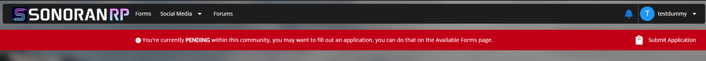

# Setting User Ranks




Make sure that you've viewed the [**Creating Ranks**](creating-departments.md) guide and have created at least one group prior to modifying user permissions.


## Navigate to the Accounts Panel

To access the "Accounts Panel", head to `Administrative Panel` > `User Accounts`

Within this "Accounts Panel" is where you'll be able to see every user that has joined your community. From here you can click and edit their information and permissions.

.png>)

## Editing Account Information

To edit a user’s account, left-click their row in the **User Accounts** table. This opens a dialog where you can update details such as Rank and Identifiers. Assigning ranks grants the user the permissions associated with those roles.

When adding identifiers, type the value and press **Enter** to apply it.

A user’s permissions are active only when their **System Status** is set to **ACTIVE**. If a user is archived, all permissions are revoked and their access to the community CMS is restricted.

.png>)

### Assign Rank to Multiple Accounts

In the `User Accounts` viewer, you can now tick the checkboxes to select multiple accounts at once. This will allow you to perform actions on multiple accounts at once.

<figure><figcaption>
Sonoran CMS - Multiple Account Selection
</figcaption></figure>

Once you have selected the desired accounts, click on the Icon button above to open a dropdown of every action you can perform. For rank management, you have the following options:

* **Set Ranks** will automatically replace all assigned ranks with whatever rank you specify
* **Add/Remove Ranks** Allows you to add or remove any ranks to selected accounts

<figure><figcaption>
Sonoran CMS - Multiple Account Actions
</figcaption></figure>

You can also perform administrative actions (currently Kick, Ban, and Archive) on multiple users at once through this dropdown.

### Alternate User Accounts Table Actions

Instead of left-clicking a user's row you can right-click which will prompt you with two actions:

* **Edit Account Information** which will pop up with the above dialog
* **View Member Profile** will redirect you to the user's community profile which will provide more information.

.png>)

 (1).png>)

If you have permission to edit the individuals information in the Account Viewer you can edit the member's name in their Community Profile by clicking their name or the blue pencil shown to the right of it. The pencil will only show if you have permission.

### Granting Expiring Ranks

You can configure any rank to expire either after a set duration or at a specific date and time. To begin, assign the user the rank you want to schedule for expiration.

After selecting the rank, click the yellow **Set to Expire** button. A dialog will appear where you can choose between a time-based expiration (e.g., after a certain number of days) or an exact expiration date and time.

Once you’ve configured the settings, click the green **Set Expiration** button to apply the expiration schedule.

<figure><figcaption>
Sonoran CMS - Rank Expiration Settings
</figcaption></figure>


Checks for rank expirations are done upon each fetch of the account and not **currently** periodically checked.


## Filtering Users by Rank

In the `User Accounts` page, you can filter users by rank so that only users who hold the rank(s) you've selected will be shown.

To filter by rank, open the dropdown menu to the right of where it says `User Accounts:`. In there you can department sub-menus and click on ranks to filter them. You can select multiple ranks to filter if you would like.

To clear filters, you can click the X in the menu box.

Below that you can alternatively choose to display Pending, Banned, or Archived members.

<figure><figcaption>
Sonoran CMS - Filter Users by Rank
</figcaption></figure>

## Grant Rank on Join


These settings can be found in `Admin Panel` > `Customization` > `On Join Actions`


You can automatically grant a default rank for all users who join your community. This could be used if you want to have a specific rank for inquiring members that only gives them access to certain forms.

In this case you would click the green plus button, add a `Modify Ranks` block, then select the rank you wish to grant.

Granting a rank will automatically change a new user's status from **Pending** to **Active**.

<figure><figcaption>
Sonoran CMS - Customization - On Join Rank
</figcaption></figure>

Alternatively, if you do **not** set a rank on join, new users' statuses will remain as **Pending**, prompting them to fill out a membership application.

<figure><figcaption>
Sonoran CMS - Pending User Form Prompt
</figcaption></figure>
