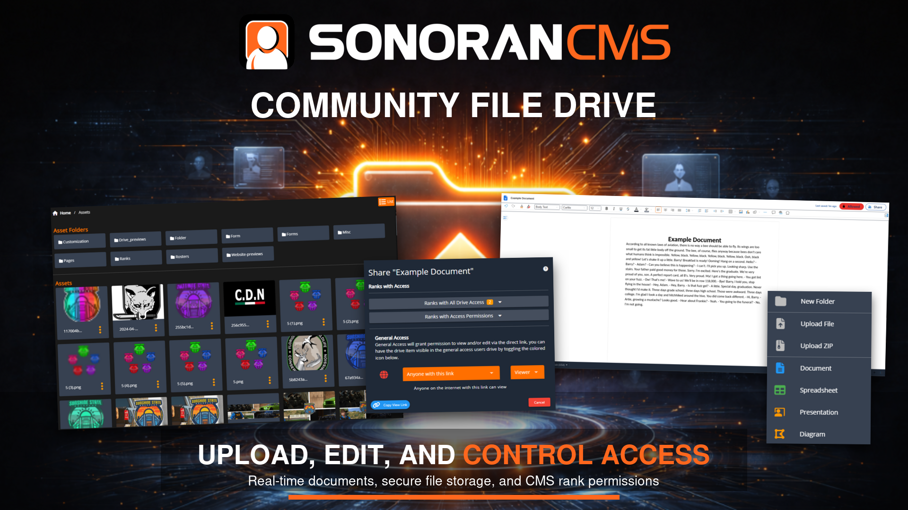
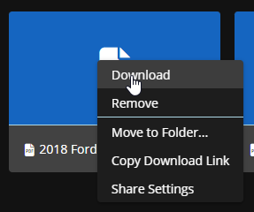

# Drive & Documents

<figure><figcaption></figcaption></figure>

With your drive, you're able to create files and folders for your community. These files are completely customizable, and have a similar style editor to the Microsoft Office suite

## Community Drive

Sonoran CMS offers a powerful file drive system allowing for live document editing, uploads and downloads, easy permission management with CMS ranks, and more! You can even [login with Google to migrate your existing Google Drive](your-drive-and-documents.md#migrate-files-from-google-drive) files!

You can navigate to your drive using the **Drive** button in the admin panel. Or, link the **Drive** to a [custom navigation bar item](community-website/website-builder.md#toolbar) for the `/drive` URL path.

### Folders

Drive Folders

Folders help you organize your community's drive! To create folders, just use the green plus button, then drag-and-drop files into the folders. You can also drag-and-drop files on the breadcrumbs on the top

<figure><figcaption>
Sonoran CMS - Drive File Path
</figcaption></figure>

To move a file without drag-and-drop, you can right click the document then **Move to Folder** and select the folder in the popup.

Right-click to access [share settings](your-drive-and-documents.md#share-settings) with them to determine who can view/edit via the direct link.

### View Mode

List vs Table View

<figure><figcaption></figcaption></figure> <figure><figcaption></figcaption></figure>

Swap the view mode between grid and list using the orange toggle at the top right.

### Share and Public View Settings

Share Settings

<figure><figcaption></figcaption></figure>

Access the **Share Settings** via the document editor **Share** button or via right-click on any drive file.

**Ranks with All Drive Access**

This shows all ranks that have the "Modify Documents (Drive)" permission, this will automatically grant them permission to modify this drive item.

**Ranks with Access Permissions**

This shows all ranks that have been added to have direct view or edit access regardless of what the General Access share type is set to. If a user has a rank listed here the drive item will show in their Drive as well. You can select what ranks you wish to give access permissions and whether they're given permission to view or edit.

**General Access**

This allows for various share settings to be applied to the drive item from a single selection. There's various options that will grant members access automatically, the options are the following:

_Restricted_

This will only utilize the Ranks with All Drive Access and Ranks with Access Permissions to determine if they have access to the document.

_Anyone with this link_

This will allow ANYONE with the share link provided with the button to either view and/or edit the file, depending on what it set. You can click the icon on the left to either hide or show the drive item in your community member's Drive, if you have it hidden they'll still have access to either view or edit depending on what's set directly through the share link. Someone who is not apart of your community's CMS or even signed into Sonoran CMS will be able to view and/or edit through the share link provided.

_Active members with this link_

This will allow all users with the community status of "ACTIVE" not "PENDING" to either view or edit the drive item, depending on what's set. You can click the icon on the left to either hide or show the drive item in their Drive, if you have it hidden they still have access to either view or edit depending on what's set directly through the share link.

_Active & pending members with this link_

This will allow all users within the community to either view or edit the drive item, depending on what's set. You can click the icon on the left to either hide or show the drive item in their Drive, if you have it hidden they still have access to either view or edit depending on what's set directly through the share link.

_Inherit Parent Folder General Access_

This will inherit the parent folder's general access settings, this will simply inherit whatever option from above the folder is set to.


**Inherit Parent Folder General Access** General Access Share Type cannot be set for any Drive item that is in the root (Home).


### Document Edit History

Document Revision History

When viewing any document in the CMS Drive, select the **Revision History** button to view recent edits.

<figure><figcaption></figcaption></figure> <figure><figcaption></figcaption></figure>

### Sensitive Documents

Marking Documents as Sensitive

You can also change the sensitivity of the document. With sensitive mode enabled, viewers will not be able to download, print, or copy the document. A watermark will also be added.

### Uploading Files

Uploading Single Files and ZIPs

Right-click anywhere in the drive or press **New** > **Upload File** or **Upload ZIP**. Uploading a ZIP file will automatically extract it to the CMS drive.

Files allowed for upload include:

* `.docx` Document
* `.xlsx` Spreadsheet
* `.pptx` Presentation
* `.pdf` PDF
* `.mp3` Audio
* `.wav` Audio
* `.rpf` GTA Archive

<figure><figcaption></figcaption></figure>

### Migrate Files from Google Drive


Due to security restrictions from Google, imports from Google Drive must be completed on the main sonorancms.com URL or app. Communities on a [custom domain](customization/custom-domain.md#custom-domain) must use the main website or app to complete this process.


Migrate Files from Google Drive

Login with Google to quickly migrate files to the CMS drive for easy permission management!

Select **New** > **Import** > **Import from Google Drive**

Follow the prompts to login, select the specific folders/files, and import them.

<figure><figcaption></figcaption></figure> <figure><figcaption></figcaption></figure>

## Drive Downloads

Drive File Downloads

There are several file types that the Sonoran CMS Drive accepts but only handles them as _downloadable_ content that isn't for viewable use. The following file types are currently supported for _downloadable content_:

* `.rpf` GTA Archive
* `.wav`, `.mp3` Audio
* `.zip` ZIP
* `.pdf` PDF

<figure><figcaption>
Sonoran CMS - Download from Drive
</figcaption></figure>

