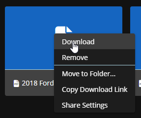

# Drive & Documents



<figure><figcaption>
Sonoran CMS - Document Drive Management
</figcaption></figure>

With your drive, you're able to create files and folders for your community. These files are completely customizable, and have a similar style editor to the Microsoft Office suite


This feature is currently experimental. It is known that phones and other small devices may not have the best compatibility with editing/viewing files


.png>)

## Your Drive

You can navigate to your drive using the `Drive` button on the menu sidebar. Once in the drive, you'll see all created documents! If you have permission to edit/create documents, then there will be some additional buttons for you

To quickly manage Drive items you can right click the item, it'll provide a menu of actions that can be performed on that item.

<figure><figcaption>
Sonoran CMS - Drive - Quick Manage (Right Click)
</figcaption></figure>

### Folders

Folders help you organize your community's drive! To create folders, just use the green plus button, then drag n drop files into the folders. You can also drag n drop files on the breadcrumbs on the top

<figure><figcaption>
Sonoran CMS - Drive File Path
</figcaption></figure>

To move a file without drag n drop, you can right click the document then <kbd>Move to Folder</kbd> and select the folder in the popup.

Folders have share settings with them to determine who can view/edit via the direct link. To edit a folder's share settings you can right click the folder and select "Share Settings".

### View Mode

You can change the view mode between grid and list by using the orange toggle button at the top right of the drive.

### Document Types

You're able to create multiple document types, from presentations to excel sheets to word files!

### Document Actions

If you have access to modify documents, then you'll be able to create/edit/delete them.

* To edit a document, press the three orange dots then Open.
* To delete a document, press the press the three orange dots then Remove
* To create a document, press the green plus button that says New.

## Editing a Document

Editing documents is simple. On the editor page, you can modify the content, rename the file, adjust sharing settings, and manage if the info is sensitive.

To rename the page, simply type the new name and press the checkmark.


**Tip:** You can view, edit, rename, etc. directly from the Drive view by right clicking a drive item. This will provide several options that are available for that item.


### Share Settings

<figure><figcaption>
Sonoran CMS - Drive - Share Settings Dialog
</figcaption></figure>

To change share settings, simply right click the file and select "Share Settings". If you're editing the document already you can simply click the "Share Settings" icon on the top right.

**Ranks with All Drive Access**

This shows all ranks that have the "Modify Documents (Drive)" permission, this will automatically grant them permission to modify this drive item.

**Ranks with Access Permissions**

This shows all ranks that have been added to have direct view or edit access regardless of what the General Access share type is set to. If a user has a rank listed here the drive item will show in their Drive as well. You can select what ranks you wish to give access permissions and whether they're given permission to view or edit.

<figure><figcaption>
Sonoran CMS - Drive - Share Settings - Select Ranks for Access Permissions
</figcaption></figure>

**General Access**

This allows for various share settings to be applied to the drive item from a single selection. There's various options that will grant members access automatically, the options are the following:

_Restricted_

This will only utilize the Ranks with All Drive Access and Ranks with Access Permissions to determine if they have access to the document.

_Anyone with this link_

This will allow ANYONE with the share link provided with the button to either view and/or edit the file, depending on what it set. You can click the icon on the left to either hide or show the drive item in your community member's Drive, if you have it hidden they'll still have access to either view or edit depending on what's set directly through the share link. Someone who is not apart of your community's CMS or even signed into Sonoran CMS will be able to view and/or edit through the share link provided.

_Active members with this link_

This will allow all users with the community status of "ACTIVE" not "PENDING" to either view or edit the drive item, depending on what's set. You can click the icon on the left to either hide or show the drive item in their Drive, if you have it hidden they still have access to either view or edit depending on what's set directly through the share link.

_Active & pending members with this link_

This will allow all users within the community to either view or edit the drive item, depending on what's set. You can click the icon on the left to either hide or show the drive item in their Drive, if you have it hidden they still have access to either view or edit depending on what's set directly through the share link.

_Inherit Parent Folder General Access_

This will inherit the parent folder's general access settings, this will simply inherit whatever option from above the folder is set to.


**Inherit Parent Folder General Access** General Access Share Type cannot be set for any Drive item that is in the root (Home).


### Sensitive Documents

You can also change the sensitivity of the document. With sensitive mode enabled, viewers will not be able to download, print, or copy the document. A watermark will also be added.

### Saving

Due to limitations with the editor, it's not able to save automatically. To save, you can press the floppy-disk icon on the top left or press `CTRL+S`

A warning will be shown if you try to leave the page with unsaved changes

### Multi-user editing

The editor allows multiple people to edit the same document at the same time! No special instructions needed, all you need to do is load up the editor and it'll handle the magic

## Uploading / Migrating Files

<figure><figcaption>
Sonoran CMS - Drive - Upload a Document
</figcaption></figure>

Sonoran CMS easily allows you to upload individual files, multiple files via a ZIP. This will allow your community to easily migrate community documents and assets easily over from standard document hosting services such as Google Drive!

### Uploading Individual Files

As shown in the image above, navigate to the Sonoran CMS Drive, click the green plus button, and then select _Upload File_.\
\
From there, you'll be able to select a file with the following type:

* `.docx` Document
* `.xlsx` Spreadsheet
* `.pptx` Presentation
* `.pdf` PDF
* `.mp3` Audio
* `.wav` Audio
* `.rpf` GTA Archive

<figure><figcaption>
Sonoran CMS - Drive - File Uploader
</figcaption></figure>

Once you select the file(s) you'd like to upload click the white cloud upload icon to the right of "Upload Document". This will now upload the file and alert you once it's completed.

### Uploading Batch Files / ZIP

As mentioned above you can upload / migrate complete directories from standard document hosting services such as Google Drive.

While in the Sonoran CMS Drive click the green plus button, and then select _Upload Zip_.

From there you'll be able to select a ZIP file, keep in mind that the following file types will be the only ones recognized by Sonoran CMS once uploaded.

* `.docx` Document
* `.xlsx` Spreadsheet
* `.pptx` Presentation
* `.pdf` PDF
* `.mp3` Audio
* `.wav` Audio
* `.rpf` GTA Archive

<figure><figcaption>
Sonoran CMS - Drive - ZIP Upload Alerts
</figcaption></figure>

Once you select the file(s) you'd like to upload click the white cloud upload icon to the right of "Upload Document". You will get alerted for all the files that were successfully uploaded from the ZIP and which ones were rejected with reason.

### Migrate Files from Google Drive

Migrating files from Google Drive to the Sonoran CMS is very easy! All you need to do is go to your Google Drive, locate the directory or select a group a files that you're wanting to migrate and right click, you'll be given several options, click the "Download" option. This will now generate and download a ZIP file containing all files/directories that you selected. Now just follow the directions that were put above to complete migrating over files.

<figure><figcaption>
Google Drive - Right Click Options
</figcaption></figure>

## Publicly Accessible Files

<figure><figcaption>
Sonoran CMS - Publicly Accessible File Preview
</figcaption></figure>

Sonoran CMS Drive allows files to be publicly viewable and editable with a simple share setting change and sharing the generated share link. When a file's general access is set to "Anyone with this link" it will allow anyone with that generated link access to view or edit the file. This will not require the user to sign in or to be part of your community.

<figure><figcaption>
Sonoran CMS - File Share Settings for Anyone with this link
</figcaption></figure>

If a user of your community accesses the public generated link they will be automatically redirected to view the file in your community's Drive.

## Drive Downloads

There are several file types that the Sonoran CMS Drive accepts but only handles them as _downloadable_ content that isn't for viewable use. The following file types are currently supported for _downloadable content_:

* `.rpf` GTA Archive
* `.wav`, `.mp3` Audio
* `.zip` ZIP
* `.pdf` PDF

<figure><figcaption>
Sonoran CMS - Download from Drive
</figcaption></figure>

When one of these file types are uploaded they'll be given different options to interact with, as shown in the image you're able to download, remove or modify the share settings. Additionally you're able to copy a direct download link to share among peers. If someone is able to see the file in their Drive they're able to download it.
