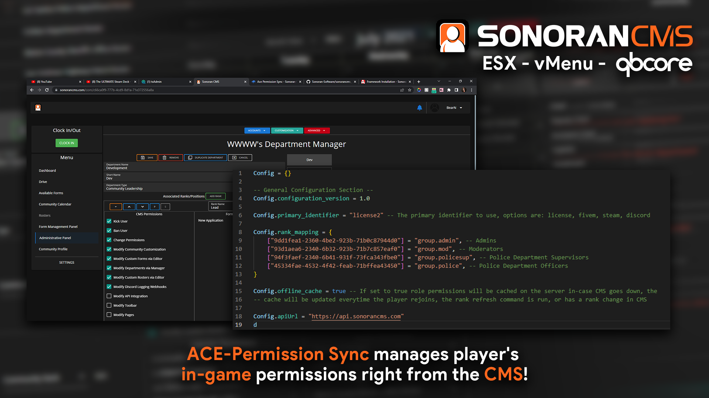

# 🏆 Why Choose Sonoran CMS?

<mark style="color:orange;"></mark>[<mark style="color:orange;">Get Sonoran CMS Pro free for 14 days!</mark>](../pricing/pricing-faq/#free-trial-sonoran-cms-pro)<mark style="color:orange;"></mark>

## 📂 [CMS Document Drive](../tutorials/getting-started/your-drive-and-documents.md)

Manage your community's documents, spreadsheets, and presentations natively in the CMS!

[Create and live edit documents](../tutorials/getting-started/your-drive-and-documents.md) to share with members based on rank. Sonoran CMS allows you to watermark documents as sensitive, organize files with folders, and more!

## 🌐 [Custom Community Pages](../tutorials/customization/custom-pages.md) and [Forums](../tutorials/getting-started/forum-system.md)

Create your own [community website](../tutorials/customization/custom-pages.md), all [on your own domain](../tutorials/customization/custom-domain.md)!

Create custom pages with community information, multi-media, announcements, and more!

Sonoran CMS even allows you to add [community forums](../tutorials/getting-started/forum-system.md) for posts, discussions, and more!

<figure><figcaption>
Sonoran CMS - Community Forums
</figcaption></figure>

## ✍️ [Custom Applications and Forms](../tutorials/getting-started/creating-custom-forms.md)

[Create fully customizable member applications](../tutorials/getting-started/creating-custom-forms.md), forms for tracking, and more!

Whether it's your own patrol log system with automatic hour calculations, an extensive new member application, or a custom community form, Sonoran CMS allows you to customize it all.

## ✅ [In-Game Whitelisting](../integration-capabilities/in-game-integration-resources/gta-rp-integrations/available-resources/whitelist.md)

Sonoran CMS is your single point of management for in-game whitelisting! Automatically whitelist players based on CMS rank for [FiveM](../integration-capabilities/in-game-integration-resources/gta-rp-integrations/available-resources/whitelist.md), [Minecraft](../integration-capabilities/in-game-integration-resources/minecraft-integrations/available-resources/whitelist.md), [Roblox](../integration-capabilities/in-game-integration-resources/roblox-integrations/available-resources/whitelist.md), and more!

## 🚫 [GTA RP ACE Permissions Management](../integration-capabilities/in-game-integration-resources/gta-rp-integrations/available-resources/ace-permission-sync.md)

Sonoran CMS allows you to manage all GTARP user permissions with [Ace Permissions Sync](../integration-capabilities/in-game-integration-resources/gta-rp-integrations/available-resources/ace-permission-sync.md)!

Sonoran CMS is your single point of management for your community!

## 🖥️ [Sonoran CAD Permission Sync](../integration-capabilities/sonoran-cad-sync.md)

Remove all the hassle of managing your community's [Sonoran CAD](https://info.sonorancad.com/why-choose-sonoran-cad/about) permissions. Sonoran CMS is now your single point of management!

Sonoran CMS allows you to easily manage your community's Sonoran CAD permissions based on their Sonoran CMS rank automatically!

## [📅](https://emojipedia.org/calendar/) [Event Management](../tutorials/calendars/community-events.md)

Sonoran CMS makes organizing [community events](../tutorials/calendars/community-events.md) easy! Manage member RSVPs, event information, Discord webhooks, and more! You can even create [custom calendar categories](../tutorials/calendars/community-calendar-categories.md)!

<figure><figcaption>
Sonoran CMS - Community Events
</figcaption></figure>

<figure><figcaption>
Sonoran CMS - Calendar Categories
</figcaption></figure>

## 📱 [Downloadable Apps](../download-the-app.md)


[download-the-app.md](../download-the-app.md)


Learn more about accessing and downloading Sonoran CMS on web, desktop, and mobile devices!

It's never been more easy to manage your gaming community, regardless of your platform!

## 🌎 [Full Translation and Locality Support](../developer-api-documentation/translation-support.md)

Only Sonoran CMS supports full[ i18n localization](../developer-api-documentation/translation-support.md). Regardless of your community's native language, Sonoran CMS supports it!\
\
Sonoran CMS translations are made possible by our community contributors! Anyone is allowed to [contribute to our GitHub translation files](https://github.com/Sonoran-Software/sonorancms\_translations).

## 📋 [Frequent Updates](../roadmap/changelog.md)

As shown in our [changelog](../roadmap/changelog.md), new features, fixes, and suggestions are added all the time!
